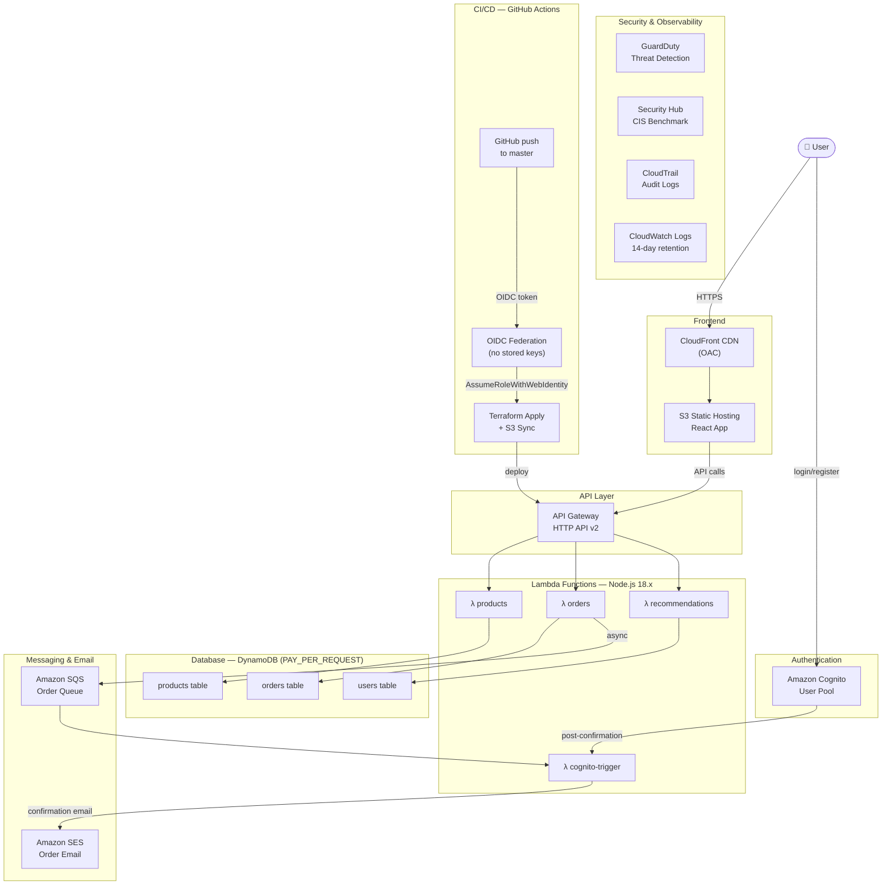
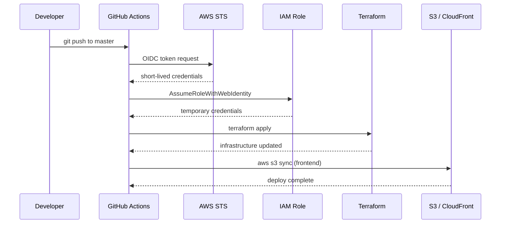

# Smart E-Commerce — AWS Serverless Portfolio Project

A fully serverless e-commerce platform built on AWS, managed entirely with Terraform and deployed via GitHub Actions CI/CD.

---

## Architecture Overview



---

## AWS Services

### Compute
| Service | Usage |
|---------|-------|
| **AWS Lambda** | 4 functions: `products`, `orders`, `recommendations`, `cognito-trigger` (Node.js 18.x) |

### API & Networking
| Service | Usage |
|---------|-------|
| **Amazon API Gateway** | HTTP API (v2) — exposes all Lambda functions as REST endpoints |
| **Amazon CloudFront** | CDN for frontend, secure S3 access via Origin Access Control (OAC) |

### Database
| Service | Usage |
|---------|-------|
| **Amazon DynamoDB** | 3 tables: `users`, `products`, `orders` — on-demand (PAY_PER_REQUEST) |

### Authentication & Authorization
| Service | Usage |
|---------|-------|
| **Amazon Cognito** | User registration, login, JWT token management |
| **AWS IAM + OIDC** | Passwordless GitHub Actions → AWS authentication via OIDC federation |

### Storage
| Service | Usage |
|---------|-------|
| **Amazon S3** | Frontend static hosting, CloudTrail audit logs, Terraform remote state |

### Messaging & Email
| Service | Usage |
|---------|-------|
| **Amazon SQS** | Decoupled order processing queue |
| **Amazon SES** | Transactional order confirmation emails |

### Security & Compliance
| Service | Usage |
|---------|-------|
| **Amazon GuardDuty** | Threat detection with S3 log monitoring |
| **AWS Security Hub** | CIS Benchmark + AWS Foundational Security Best Practices standards |
| **AWS CloudTrail** | Multi-region API audit trail (S3 and Lambda data event logging) |

### Observability
| Service | Usage |
|---------|-------|
| **Amazon CloudWatch Logs** | Lambda and API Gateway logs with 14-day retention |

### CI/CD & Infrastructure as Code
| Tool | Usage |
|------|-------|
| **Terraform** | All infrastructure defined as code; remote state in S3, locking via DynamoDB |
| **GitHub Actions** | Push to `master` → automatic Terraform apply + React frontend deploy |

---

## Infrastructure Layout

```
terraform/
├── bootstrap/    # S3 state bucket + DynamoDB lock table
├── management/   # IAM roles, OIDC provider for GitHub Actions
├── security/     # GuardDuty, Security Hub
├── log/          # CloudTrail, audit log S3 bucket
└── workload/     # Lambda, API Gateway, DynamoDB, Cognito, SQS, SES, S3, CloudFront

frontend/         # React app (AWS Amplify v6 for Cognito auth)
lambda/           # Node.js Lambda function source code
.github/
└── workflows/
    ├── terraform-plan.yml   # Runs on pull request
    ├── terraform-apply.yml  # Runs on push to master (terraform/**)
    └── frontend-deploy.yml  # Runs on push to master (frontend/**)
```

---

## CI/CD Pipeline

Authentication uses **OIDC federation** — no AWS access keys stored in GitHub. GitHub Actions assumes an IAM role directly via a short-lived token.



---


## Features

- Product listing with category filters and search
- Product detail page with "Similar Products" recommendations
- Personalized "Recommended for You" spotlight section on product listing
- User registration and login via Cognito
- Order placement with SQS-based async processing
- Order confirmation email via SES
- Fully automated infrastructure provisioning and frontend deployment

---

## Region

All resources deployed in **eu-central-1** (Frankfurt).
